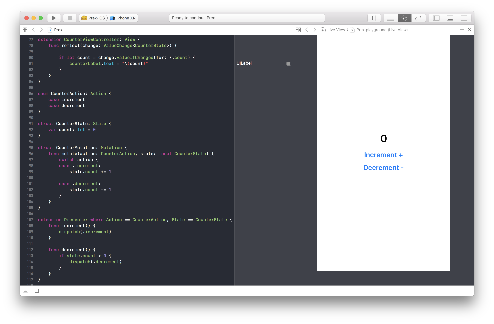

<p align="center">
  
</p>
<p align="center">
  
  <a href="https://developer.apple.com/swift">
    
  </a>
  <a href="https://github.com/Carthage/Carthage">
    
  </a>
  <a href="https://cocoapods.org/pods/Prex">
    
  </a>
  <a href="https://cocoapods.org/pods/Prex">
    
  </a>
  <a href="https://travis-ci.org/marty-suzuki/Prex">
    
  </a>
</p>

Prex is a framework which makes an unidirectional data flow application possible with MVP architecture.

## Concept

Prex represents **Pre**senter + Flu**x**, therefore it is a combination of Flux and MVP architecture.
In addition, Reactive frameworks are not used in Prex.
To reflect a state to a view, using **Passive View Pattern**.
Flux are used behind of the Presenter.
Data flow is unidirectional that like a below figure.


If you use Prex, you have to implement those components.

- [State](#state)
- [Action](#action)
- [Mutation](#mutation)
- [Presenter](#presenter)
- [View](#view)

### State

The State has properties to use in the View and the Presenter.

```swift
struct CounterState: State {
    var count: Int = 0
}
```

### Action

The Action represents internal API of your application.
For example, if you want to increment the count of CounterState, dispatch Action.increment to Dispatcher.

```swift
enum CounterAction: Action {
    case increment
    case decrement
}
```

### Mutation

The Mutation is allowed to mutate the State with the Action.

```swift
struct CounterMutation: Mutation {
    func mutate(action: CounterAction, state: inout CounterState) {
        switch action {
        case .increment:
            state.count += 1

        case .decrement:
            state.count -= 1
        }
    }
}
```

### Presenter

The Presenter has a role to connect between View and Flux components.
If you want to access side effect (API access and so on), you must access them in the Presenter.
Finally, you dispatch those results with `Presenter.dispatch(_:)`.

```swift
extension Presenter where Action == CounterAction, State == CounterState {
    func increment() {
        dispatch(.increment)
    }

    func decrement() {
        if state.count > 0 {
            dispatch(.decrement)
        }
    }
}
```

### View

The View displays the State with `View.reflect(change:)`.
It is called by the Presenter when the State has changed.
In addition, it calls the Presenter methods by User interactions.

```swift
final class CounterViewController: UIViewController {
    private let counterLabel: UILabel
    private lazy var presenter = Presenter(view: self,
                                           state: CounterState(),
                                           mutation: CounterMutation())

    @objc private func incrementButtonTap(_ button: UIButton) {
        presenter.increment()
    }

    @objc private func decrementButtonTap(_ button: UIButton) {
        presenter.decrement()
    }
}

extension CounterViewController: View {
    func reflect(change: ValueChange<CounterState>) {
        if let count = change.valueIfChanged(for: \.count) {
            counterLabel.text = "\(count)"
        }
    }
}
```

You can get only specified value that has changed in the State with `ValueChange.valueIfChanged(for:)`.

## Advanced Usage

### Shared Store

Initializers of the Store and the Dispatcher are not public access level.
But you can initialize them with `Flux` and inject them with `Presenter.init(view:flux:)`.

This is shared Flux components example.

```swift
extension Flux where Action == CounterAction, State == CounterState {
    static let shared = Flux(state: CounterState(), mutation: CounterMutation())
}
```

or

```swift
enum SharedFlux {
    static let counter = Flux(state: CounterState(), mutation: CounterMutation())
}
```

Inject `Flux` like this.

```swift
final class CounterViewController: UIViewController {
    private lazy var presenter = {
        let flux =  Flux<CounterAction, CounterState>.shared
        return Presenter(view: self, flux: flux)
    }()
}
```

### Testing

Description is *COMING SOON!*


## Example

### Project

You can try Prex with GitHub Repository Search Application [Example](./Example).
Open PrexSample.xcworkspace and run it!

### Playground

You can try Prex counter sample with Playground!
Open Prex.xcworkspace and build `Prex-iOS`.
Finally, you can run manually in Playground.



## Requirements
- Xcode 9.4.1 or greater
- iOS 10.0 or greater
- tvOS 10.0 or greater
- macOS 10.10 or greater
- watchOS 3.0 or greater
- Swift 4.1 or greater

## Installation

### Carthage

If you’re using [Carthage](https://github.com/Carthage/Carthage), simply add Prex to your `Cartfile`:

```ruby
github "marty-suzuki/Prex"
```

### CocoaPods

Prex is available through [CocoaPods](https://cocoapods.org). To install it, simply add the following line to your Podfile:

```ruby
pod 'Prex'
```

### Swift Package Manager

Prex is available through `Swift Package Manager`. Just add the url of this repository to your `Package.swift`.

```Package.swift
dependencies: [
    .package(url: "https://github.com/marty-suzuki/Prex.git", from: "0.1.0")
]
```

## Inspired by these unidirectional data flow frameworks

- [VueFlux](https://github.com/ra1028/VueFlux) by [@ra1028](https://github.com/ra1028/VueFlux)
- [ReactorKit](https://github.com/ReactorKit/ReactorKit) by [@devxoul](https://github.com/devxoul)

## Author

marty-suzuki, s1180183@gmail.com

## License

Prex is available under the MIT license. See the [LICENSE](./LICENSE) file for more info.
